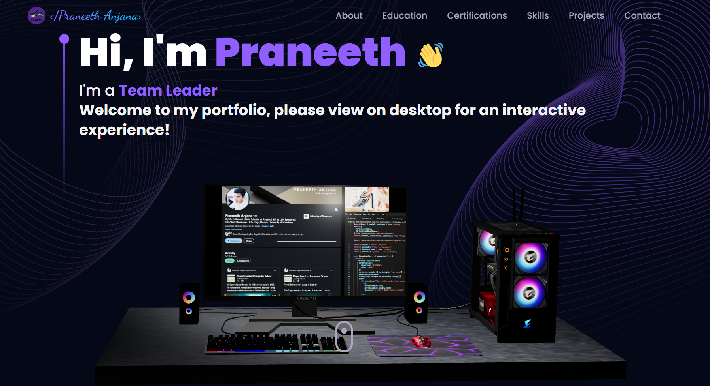

# 🚀 Praneeth Anjana's Portfolio

A modern, interactive 3D portfolio website built with React.js, Three.js, and Tailwind CSS. This portfolio showcases my projects, skills, education, and professional experience through an immersive 3D interface.



## ✨ Features

- **3D Interactive Design**: Immersive 3D models and animations using Three.js and React Three Fiber
- **Responsive Design**: Fully responsive across all device sizes
- **Modern UI/UX**: Clean, professional design with smooth animations
- **Interactive Sections**:
  - Hero section with 3D models
  - About me with animated elements
  - Education timeline
  - Skills showcase with tech stack
  - Project portfolio with live demos
  - Contact form with email integration
  - Extracurricular activities

## 🛠️ Tech Stack

- **Frontend Framework**: React.js 18
- **3D Graphics**: Three.js & React Three Fiber
- **Styling**: Tailwind CSS
- **Build Tool**: Vite
- **Animation**: Framer Motion
- **Email Service**: EmailJS
- **Additional Libraries**:
  - React Router for navigation
  - React Vertical Timeline Component
  - React Tilt for interactive effects
  - React Confetti for celebrations
  - React Hot Toast for notifications

## 🚀 Getting Started

### Prerequisites

- Node.js (version 14 or higher)
- npm or yarn package manager

### Installation

1. **Clone the repository**

   ```bash
   git clone https://github.com/fernandonpa/praneeth-portfolio.git
   cd praneeth-portfolio
   ```

2. **Install dependencies**

   ```bash
   npm install
   ```

3. **Start the development server**

   ```bash
   npm run dev
   ```

4. **Open your browser**
   Navigate to `http://localhost:5173` to view the portfolio

### Available Scripts

- `npm run dev` - Start development server
- `npm run build` - Build for production
- `npm run preview` - Preview production build locally
- `npm run lint` - Run ESLint for code quality

## 📁 Project Structure

```
praneeth-portfolio/
├── public/
│   ├── desktop_pc/          # 3D model assets
│   └── planet/              # 3D model assets
├── src/
│   ├── assets/              # Images, icons, and static files
│   ├── components/          # React components
│   │   ├── canvas/          # 3D canvas components
│   │   ├── About.jsx        # About section
│   │   ├── Contact.jsx      # Contact form
│   │   ├── Education.jsx    # Education timeline
│   │   ├── Hero.jsx         # Hero section
│   │   ├── Navbar.jsx       # Navigation
│   │   ├── Tech.jsx         # Technology skills
│   │   └── Works.jsx        # Project showcase
│   ├── constants/           # Static data and configurations
│   ├── hoc/                 # Higher-order components
│   ├── utils/               # Utility functions
│   ├── App.jsx              # Main application component
│   └── main.jsx            # Application entry point
├── index.html               # HTML template
├── package.json             # Dependencies and scripts
├── tailwind.config.js       # Tailwind CSS configuration
├── vite.config.js          # Vite configuration
└── README.md               # Project documentation
```

## 🎨 Customization

### Personal Information

Update your personal information in `src/constants/index.js`:

- Bio and introduction
- Education details
- Skills and technologies
- Projects and work experience
- Contact information

### Styling

- Modify `tailwind.config.js` for custom colors and themes
- Update CSS variables in `src/index.css`
- Customize component styles in individual component files

### 3D Models

- Replace 3D models in the `public/` directory
- Update model references in canvas components

## 📧 Contact Form Setup

To enable the contact form:

1. Sign up for [EmailJS](https://www.emailjs.com/)
2. Create an email service and template
3. Add your EmailJS credentials to the contact form component

## 🌐 Deployment

### Vercel (Recommended)

1. Push your code to GitHub
2. Connect your repository to Vercel
3. Deploy with automatic builds

### Manual Build

```bash
npm run build
```

The `dist/` folder contains the production build ready for deployment.

## 📱 Performance Optimizations

- Lazy loading of 3D models
- Optimized images and assets
- Code splitting with React Router
- Efficient re-rendering with React best practices
- Compressed builds with Vite

## 🤝 Contributing

1. Fork the repository
2. Create a feature branch (`git checkout -b feature/AmazingFeature`)
3. Commit your changes (`git commit -m 'Add some AmazingFeature'`)
4. Push to the branch (`git push origin feature/AmazingFeature`)
5. Open a Pull Request

## 📄 License

This project is open source and available under the [MIT License](LICENSE).

## 👨‍💻 Author

**Praneeth Anjana**

- Portfolio: [Live Demo](https://your-portfolio-url.com)
- GitHub: [@fernandonpa](https://github.com/fernandonpa)
- LinkedIn: [Your LinkedIn](https://linkedin.com/in/your-profile)

## 🙏 Acknowledgments

- [Three.js](https://threejs.org/) for 3D graphics
- [React Three Fiber](https://docs.pmnd.rs/react-three-fiber) for React Three.js integration
- [Tailwind CSS](https://tailwindcss.com/) for styling
- [Framer Motion](https://www.framer.com/motion/) for animations
- 3D models from various sources (see individual model licenses)

---

⭐ Star this repository if you found it helpful!
